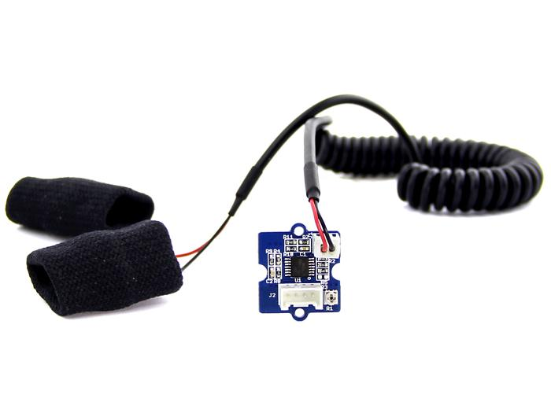
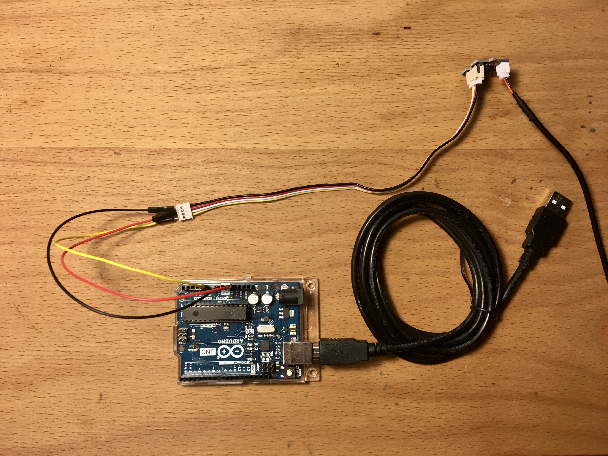
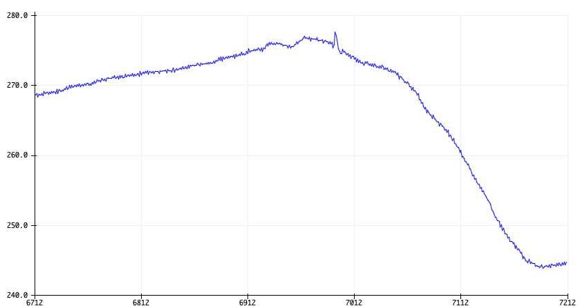

# GSR sensor tutorial

GSR staat voor Galvanic Skin Response en meet de geleiding van de huid. Met de [GSR sensor van Seeed](http://wiki.seeedstudio.com/Grove-GSR_Sensor/) meten we de weerstand van de huid tussen twee elektroden die je over 2 vingers kan schuiven. Sterke emoties kunnen je sympathische zenuwstelsel stimuleren, waardoor er meer zweet wordt afgescheiden door de zweetklieren. 



## Hardware

Je hebt nodig:

* Arduino UNO en USB kabel
* Seeed Studios Grove GSR sensor
* 3 male-male jumper kabeltjes (liefst rood, zwart en geel)

De GSR sensor komt met een Grove kabel, die kan je niet direct aansluiten op een Arduino. Met jumper kabels kunnen we de Arduino verbinden met de Grove connector:

| Arduino | Grove-GSR Sensor |
|------------------|---------|
| GND              | Zwart  |
| 5V               | Rood   |
| (niet vebonden)  | Wit    |
| A0               | Geel   |

Met de zwarte (GND) en rode (5V) kabels krijgt de sensor stroom en over de gele kabel stuurt de sensor analoge waarden naar de Arduino.



## Software

Het volgende eenvoudige prograamma stuurt 20 keer per seconde een gemiddelde waarde van 10 metingen over de seriële verbinding van de USB kabel naar de computer:

```cpp
void setup(){
  Serial.begin(9600);
}

void loop(){
  long sum = 0;
  for(int i = 0; i < 10; i++ ) {
    int sensorValue=analogRead( A0 );
    sum += sensorValue;
    delay(5);
  }
  Serial.println( sum / 10.0 );
}
```

Gebruik de [Arduino IDE](https://www.arduino.cc/en/Main/Software) om deze code te uploaden naar de Arduino UNO met `Sketch > Upload`.  Zorg dat de instellingen onder `Tools > Board` en `Tools > Port` juist zijn ingesteld.

## Ijking

Voor je de sensor over je vingers schuift moet je de sensor ijken. 

Onder `Tools > Serial Monitor` kan je de waarden die de Arduino doorstuurt volgen. Check dat de baud rate van de monitor op 9600 baud staat, net zoals in de code.

Gebruik een kleine schroevendraaier om de sensor te ijken zodat ie een output geeft van rond de 512 alvorens je de elektroden over je vingers schuift.

## Data!

Onder `Tools > Serial Plotter` kan je een grafiek maken van de waarden van de sensor. Experimenteer met in te ademen, stress, etc om de metingen hoger en lager te laten bewegen.


